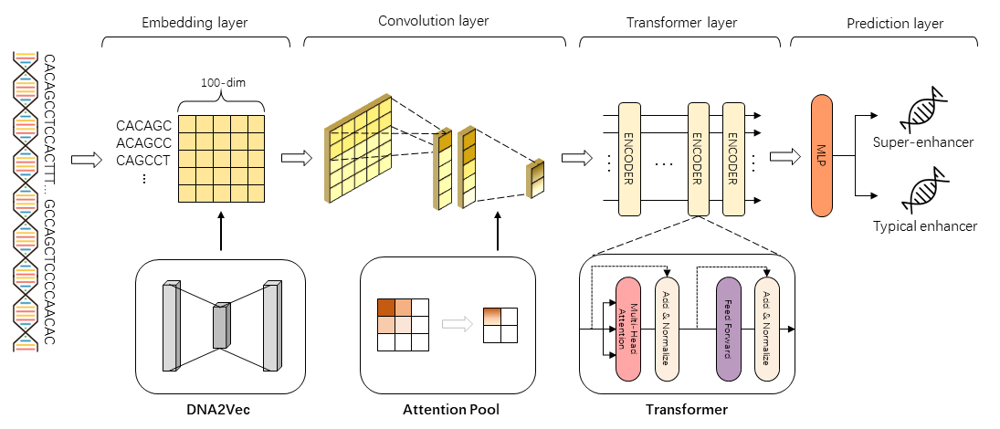

# DeepSEQ
DeepSEQ: a deep learning framework for discriminating super- and typical enhancers by sequence information



## 1. Environment setup

We recommend you to build a python virtual environment with [Anaconda](https://docs.anaconda.com/anaconda/install/linux/). We applied training on a single NVIDIA TITAN X with 12 GB graphic memory. If you use GPU with other specifications and memory sizes, consider adjusting your batch size accordingly.


#### 1.1 Create and activate a new virtual environment

```
conda create -n deepse python=3.8
conda activate deepse
```


#### 1.2 Install the package and other requirements

(Required)

```
git clone https://github.com/lhy0322/DeepSEQ
cd DeepSEQ
python -m pip install -r requirements.txt
```
